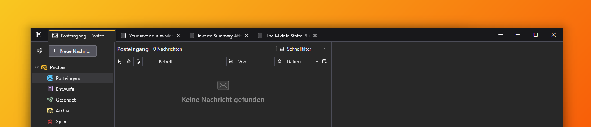

# BirdOne

One-line layout for Thunderbird: tabs and unified toolbar share a single
row, global search hidden (use CTRL+K).

> Tested on Thunderbird 152 (Supernova UI, 115+ required) on Windows.

### Features

>- Tab bar and unified toolbar merged into one row: tabs on the left, toolbar buttons on the right, next to the window controls
>- Responsive: below 850px window width the layout falls back to the default two-row interface
>- Fixed amber accent (`#fabd2f`) decoupled from the Windows accent colour – selection highlights, primary button and focus rings stayamber regardless of the OS setting
>- Colour as signal (dark mode): context menus, app menu, toolbar icons, column headers, recipient pills and compose-window controls answer hover with amber text/icons instead of a background block.
>- Message list selection, the "New Message" button and the header/compose toolbar buttons use a subtle amber tint with a 1px amber outline instead of a solid amber block
>- Square popup corners: no rounded inner corners in context menus and panels

### Installation
>
>1. Download [`userChrome.css`](https://github.com/Firnschnee/BirdOne/blob/main/userChrome.css)
>
>2. In Thunderbird go to **Settings → General**, scroll to the bottom and open **Config Editor**. Search for
   **`toolkit.legacyUserProfileCustomizations.stylesheets`** and set it to **`true`**.
>
>3. Recommended: in the same Config Editor set **`mail.tabs.autoHide`** to **`false`**, so the tab bar (and with it the one-line layout) is always visible, even with a single tab.
>
>4. Find your profile folder: **Help → Troubleshooting Information → Profile Folder → Open Folder**.
>
>5. Create a `chrome` folder inside the profile folder if it doesn't exist, then copy `userChrome.css` into it.
>
>6. Restart Thunderbird. The layout applies on restart.

### Customisation
>BirdOne is configurable through CSS variables. See all options → [docs/customisation.md](docs/customisation.md)

### Firefox? 
> You are looking for [FoxOne!](https://github.com/Firnschnee/FoxOne)
---
Concept inspired by [NeroWolfe_'s one-line experiment](https://www.reddit.com/r/Thunderbird/comments/15klzpr/oneliner_for_thunderbird/) | License: [MIT](LICENSE)
